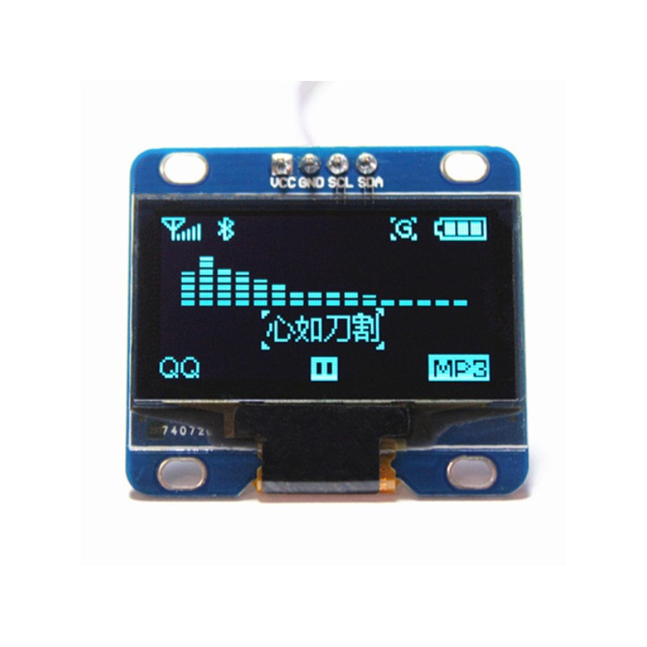
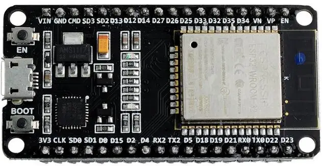
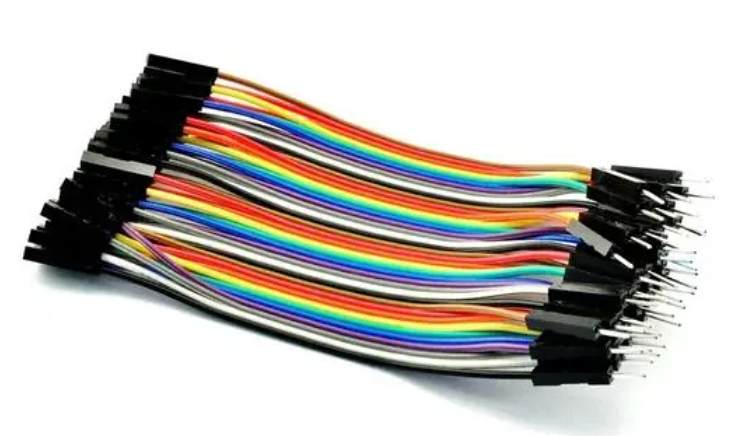
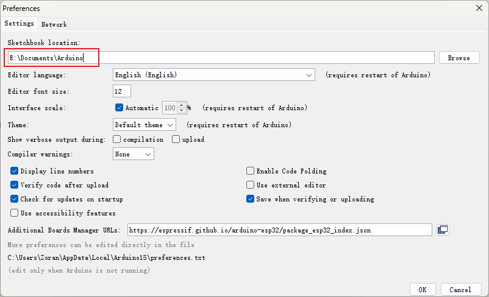
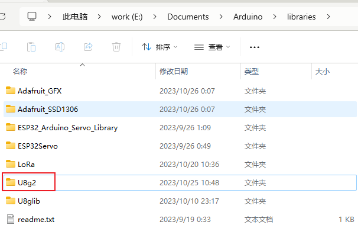
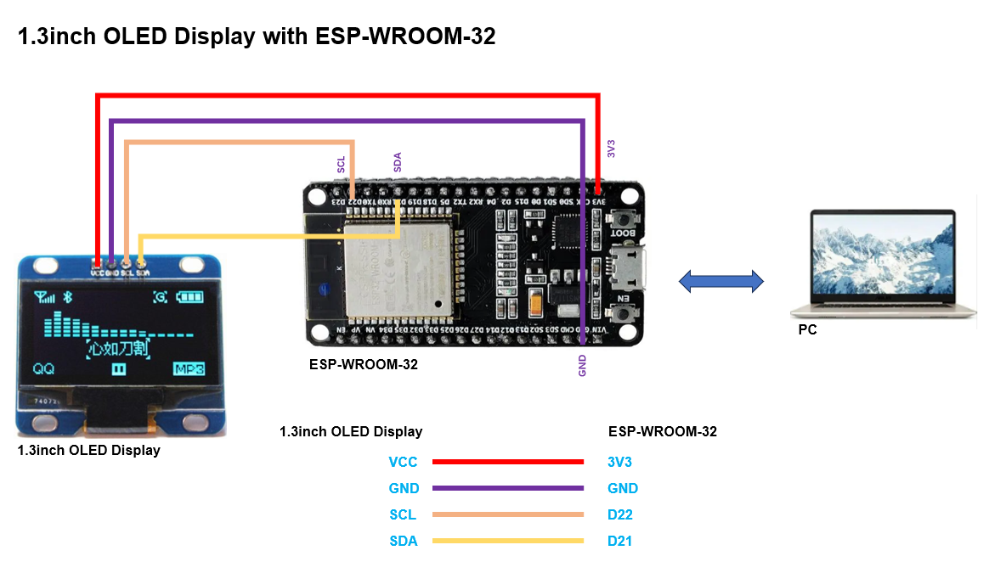
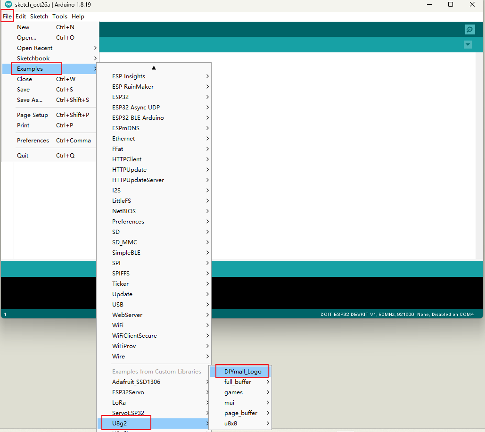
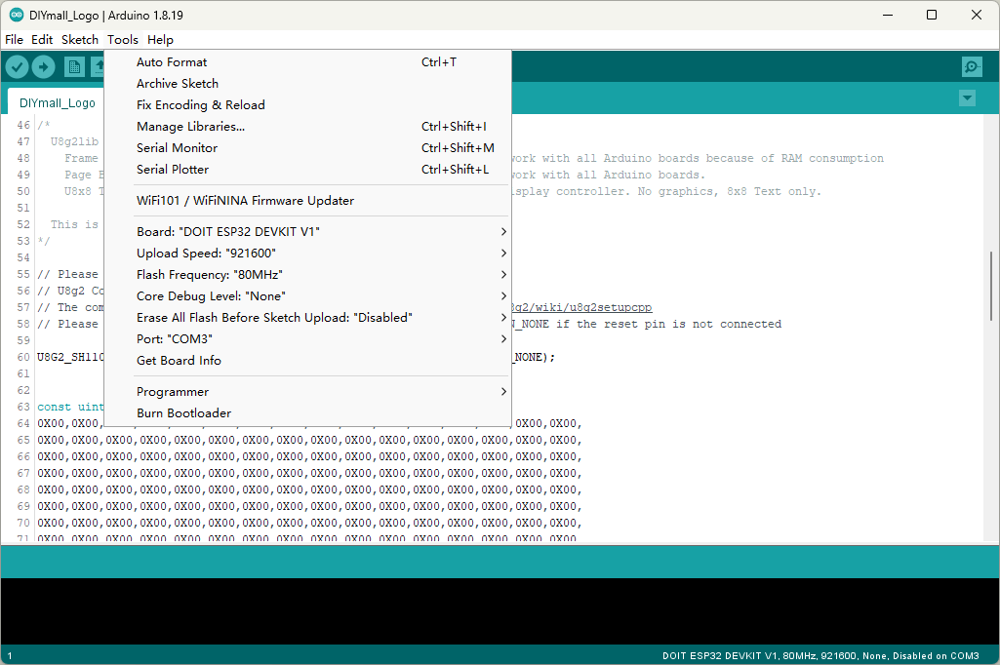
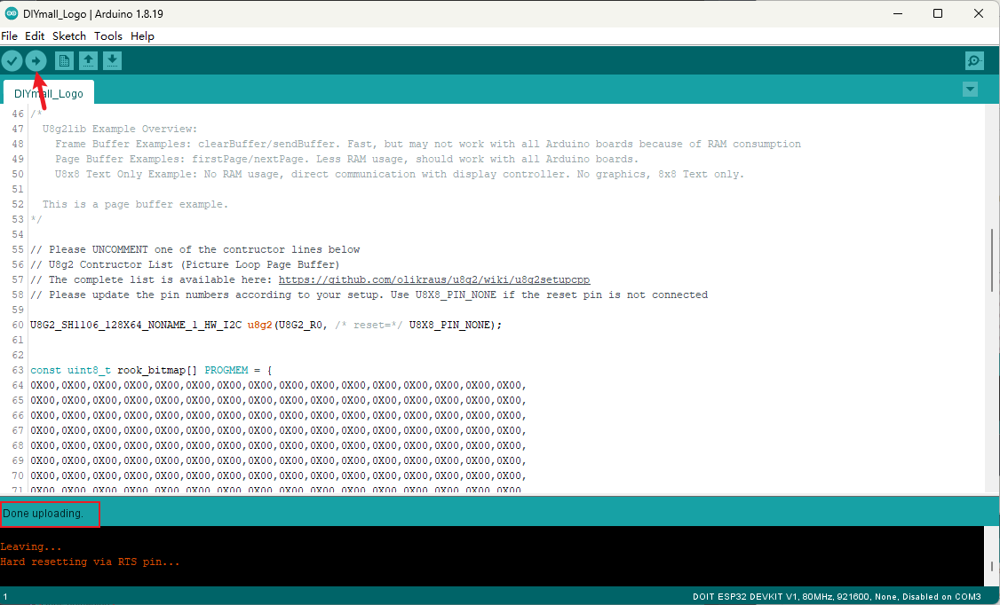
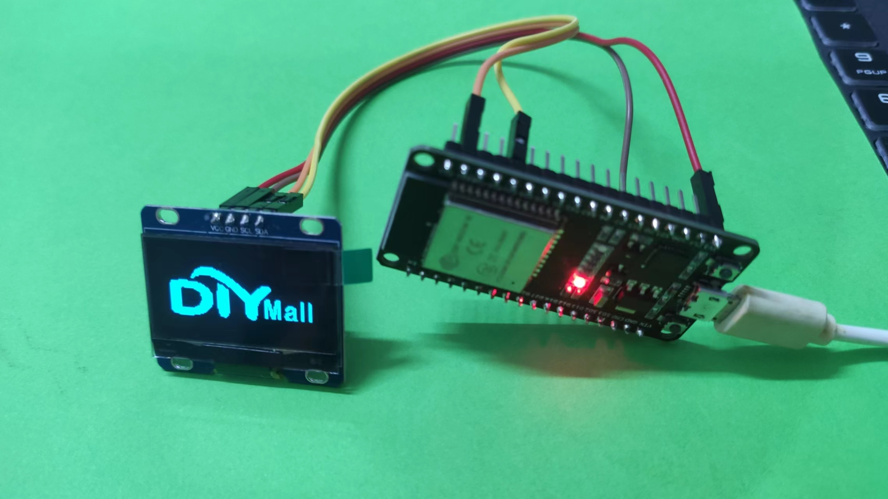

# 【1.3INCH_OLED_IIC_SH1106】在ESP-WROOM-32开发板上的运用
本教程目的是指导如何通过ESP-WROOM-32开发板对1.3英寸SH1106的OLED进行显示图像操作。
资料包下载：[1.3inch_BULE_OLED_IIC12864_SH1106.zip](https://pan.baidu.com/s/1JV9Z0a2VLDOwMUmUkQ3qJA?pwd=6e24)

# 1. 硬件需求
>* OLED：1.3inch IIC接口 SH1106

 
>* ESP-WROOM-32开发板：ESP-WROOM-32 开发板一块及对应的USB数据线一条
 

>* 杜邦线：两头都是母头的2.54mm杜邦线一排

>* 电脑：Windows/Mac 电脑一台（本教程使用Windows 11 64位系统）

# 2. 软件需求
>* 编程软件：Arduino IDE 1.8.19 （仅代表本教程测试版本，可以使用其他版本）
如果还未安装，请在Arduino官网链接进行Arduino IDE下载安装：[Arduino software](https://www.arduino.cc/en/software)
>* Arduino库：U8g2（A标准库形式需要进行部分修改。请确保您正在使用上方提供的资料包（里面更改了一些定义部分）。如果这些文件已经在库中，建议先更换）

U8g2库安装说明：

1. 在Arduino IDE中，转到 **File** >  **Preferences**  

2. 转到红色框中所指向的文件夹 

3. 解压缩上方资料包，把路径 **1.3inch_BULE_OLED_IIC12864_SH1106\Arduino Example\heltec1.3OLED-master** 文件夹里的“U8g2”文件夹步骤2中的位置

# 3. 硬件接线说明
13inch OLED同ESP-WROOM-32接线示意图

# 4. 例程测试
按如上接好线后打开一个例程进行测试。

1. 打开一个**Logo_DIYmall**例程，在Arduino IDE中，转到 **File** >  **Examples** >  **U8g2** >  **DIYmall_Logo**。

2. 选择对应的开发板**DOIT ESP32 DEVKIT V1**以及对应的COM口。

3. 进行编译烧录

# 5. 测试
此次例程会在OLED屏幕上显示一个LOGO。
